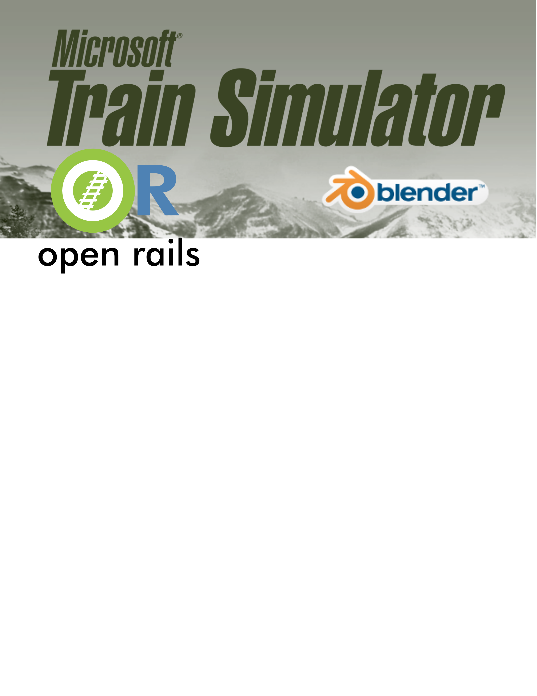

= Blender Exporter for MSTS and OPEN RAILS
:toc:
:toclevels: 5
:toc-title: Contents
:sectnums!:
:sectids!:
:chapter-label:
:doctype: book
:author: Wayne Campbell & Pete Willard
:email: petewillard@gmail.com
:homepage: http://www.railsimstuff.com
:revision: 1.0
:copyright: Copyright © 2020 - 2023
:title-page-background-image: 
:encoding: utf-8
:lang: EN
:experimental:
:icons: font
:pdf-page-size: [8.25in, 10.9in]
:gr: `
:mu: µ
:ohm: Ω
:dot: *
:union: ∩
:degree: °
:C: ©
:arrow: →
:shift:
:bar: |
:bleft: [
:bright: ]
:hash: #
:bslash: \
:BL: {
:BR: }
:sourcedir: code
:source-highlighter: rouge
:revnumber: .0.4
:revdate: 2023-07-13
:OR: Open Rails
:ORTS: Open Rails Train Simulator
:MSTS: Microsoft Train Simulator
:version: Blender 3.6 LTS
:BV: 3.6
:AO: Ambient Occlusion

<<<
:numbered!:
[colophon]

Microsoft Train Simulator and  Open Rails exporter add-on for Blender 

{revdate} {revision}{revnumber} {author}  

COPYRIGHT
(c) 2019 by Wayne Campbell distributed under the terms of the GNU GPL V3

This program is free software: you can redistribute it and/or modify it under the terms of the GNU General Public
License, Version 3, as published by the Free Software Foundation here.
This program is distributed in the hope that it will be useful, but WITHOUT ANY WARRANTY; without even the
implied warranty of MERCHANTABILITY or FITNESS FOR A PARTICULAR PURPOSE. See the GNU General
Public License, included in the distribution package, for more details.

You are welcome to repost this package, with local language translations if needed, on your local community web
site. Keep the package together with this document containing the copyright notice. Drop me an email so I can tell
others where its available.

== Microsoft Train Simulator/Open Rails exporter add-on for Blender

Blender 2.8+ Exporter for MSTS/OR

* Version 4.4
* This is a script addon for the Blender 3D program. Use it to create .S shape files for Microsoft Train Simulator or Open Rails.
* This version of the EXPORTER is for BLENDER 2.8 and above Use V3.5 of the EXPORTER for PRIOR VERSIONS of BLENDER

=== Conventions Used

NOTE: Regular Note.

WARNING: Pay attention to these.

IMPORTANT: You should know this.

CAUTION: With care, you can succeed.

TIP: Optional, but good to know.

`Highlighting`

*BOLD*

_Italic_

----
Source code
----

kbd:[LMB]:: Left Mouse Button
kbd:[MMB]:: Middle Mouse Button
kbd:[RMB]:: Right Mouse Button
_N-Panel_:: Number Panel, kbd:[N] Hotkey in Main 3D Window
btn:[ENTER]:: Sometimes you will see KEYBOARD entry look like this

Referenced footnotes appear at the *end* of Chapters

Web Links should be active and will open in your web browser if your PDF reader supports it.

:numbered!:

:sectids!:
:numbered!:
include::guide.adoc[]

