== Installation

Open the downloaded zip file and drag the contents to your desktop or another convenient folder.

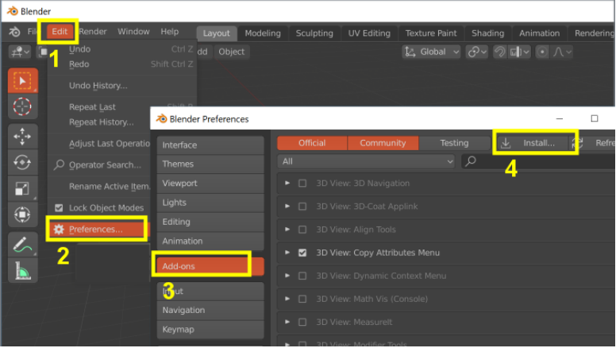

[grid="none",cols="5%,95%",frame="none"]
|===
|Step| Action

|1 |Press Edit in the menu bar
|2 |Select Preferences
|3 |Choose the Add-ons tab
|4 |Click on Install and Navigate to your desktop or where you extracted the download zip
|===

<<<

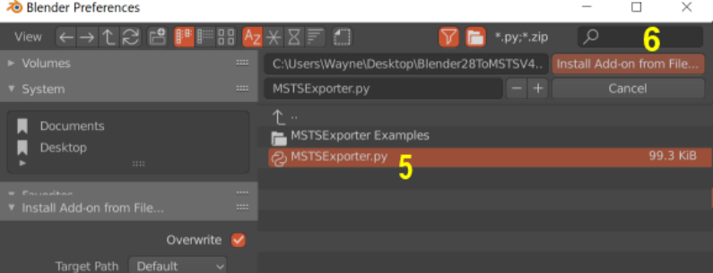

[grid="none",cols="5%,95%",frame="none"]
|===
|Step| Action

|5 |Select `MSTSExporter.py`
|6 |Click on `Install Add-on from File`
|===

Scroll down to the script:: Export OpenRails/MSTS

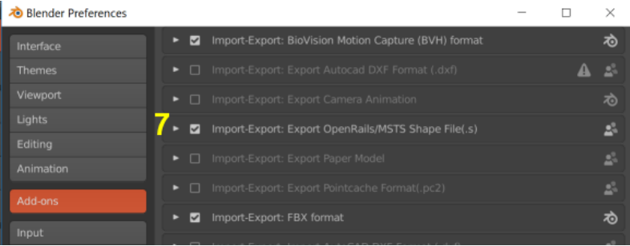

[grid="none",cols="5%,95%",frame="none"]
|===
|Step| Action

|7 |Check the box to enable it
|===

[NOTE]
====
To MANUALLY INSTALL the addon, copy *MSTSExporter.py* to your "addons" folder, usually located at:

*C:\Users\[username]\AppData\Roaming\Blender Foundation\Blender\[blender version]\scripts\addons*

( The location is referring to your USERNAME and your current VERSION of Blender )

RESTART BLENDER
====

[TIP]
The "Appdata" folder in a Windows machine is "hidden" by default, so you might need to go to file explorer options and adjust the settings so "hidden" folders are made visible.

== Examples

Included in the package are:

Building\UnionStop:: an example of a simple model that uses two different textures.
Loco\L1:: a more complex example that includes animation and LOD levels.
Tutorial:: contains texture file for use in the tutorial section of this document

=== What's Changed With The 2.8 Upgrade

The exporter now supports Blender 2.8's new Eevee rendering engine and materials.
Unfortunately however Blender has discontinued support for Blender Internal materials and face texture methods.
This means that any models originally made in 2.79 must be retextured if they are brought into Blender 2.8.

Another change relates to LODs and part naming. The updated exporter uses Blender's new 'collections' feature
to organize the LODs of a model. We no longer have a model named 'MAIN'. Instead we have a collection named
MAIN that contains all the parts we want to export. 

More detail is provided later in the manual. Models originally made in 2.79 must be reorganized into collections when they are brought into Blender 2.8.

* The `DLEVEL`, `DMIN`, `DMAX` method of assigning LODS is no longer supported in the exporter.
* The Railworks style part naming is no longer supported in the exporter.
* The exporter no longer exports particle systems or bezier curves directly. These must be converted to meshes before export.
* The exporter is 4 times faster than the previous version ( based on exporting L1 example file )

== Overview

* look for the export script in Blender's File - Export menu.
* cloned objects and object modifiers are fully supported
* externally linked objects are fully supported
* if an object is not textured in Blender, the default texture, blank.ace, will be applied.

=== Optimizations

The script includes a number of optimizations for higher frame rates and better GPU and CPU usage including:

* Primitive consolidation which reduces batch calls by consolidating tris from different objects when they use the
same material
* Large primitives, vertex_sets, and subobjects are split as needed to prevent them from exceeding MSTS's loading
limits.
* Complex hierarchies are simplified and collapsed to prevent exceeding MSTS's hierarchy depth limits and to
improve effectiveness of the primitive consolidation. However animated nodes are always retained. 

This includes ones where you have applied an animation in Blender, as well as the following named parts:

|===
|BOGIE1 |BOGIE2 |WHEELS11 |WHEELS12 |WHEELS13 |WHEELS21 |WHEELS22 |WHEELS23
|===

[NOTE]
You can disable this optimization and force the exporter to retain all part names with a checkbox option in the exporter
window. 

<<<

===  Arranging Parts And Lods In The Outliner

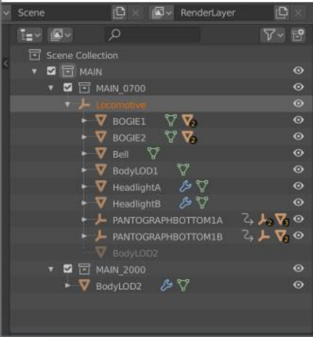

You must have a collection called `MAIN` in your scene. It must be attached directly to 'Scene Collection'
`MAIN` contains one or more sub collection for each LOD, in this example, `MAIN_0700` and `MAIN_2000`.
These LOD collections will contain all your parts.

You create parts and drag and drop them into whatever LOD you want. You can see in the example there is a
BodyLOD1 in `MAIN_0700` and a lower resolution "BodyLOD2" in `MAIN_2000`. 

[NOTE]
"BodyLOD2" also appears grayed out in `MAIN_0700`. This shows you where it is in the Locomotive hierarchy, but grayed out since it isn't part of that LOD collection.

* You can control which LOD is visible in your viewport with the checkboxes beside each LOD collection. You can also create Render Layers that show one LOD or the other in a render.

* Use standard MSTS part names such as *BOGIE1*, *WHEELS11* for animated parts. (See the "Optimized" section for a list of
recoginized parts ) These key names *must* be in all capital letters to ensure they are retained in the exported
shape file. 

* Use lower case or mixed case names for all other parts.

* The exporter supports objects linked to other blend files ( File, Link ). With the limitation that animation in those
linked files will not be exported.

=== Using the Outliner Window

* Dragging and dropping in the new outliner takes some pracyice. If you are moving a part from one LOD collection to
another, just use the drag and drop method. 

* If you are moving it to a new level in the hierarchy, drag and Shift drop. If you want a part to be seen further out, add it to more than one LOD using drag and btn:[Ctrl] then drop.

[NOTE]
Instead of dragging and dropping, use the btn:[M] key in the 3D viewport. Select an object, press btn:[M], and choose the target LOD collections. Another option is to examine LOD collection assignment in the object tab of the properties panel.

[TIP] - if you use Blender primarily for MSTS/ORTS models, you can add a `MAIN` and an empty `LOD` collection to your initial startup file and then save it as the default startup with menu:File[Defaults, Save Startup File] to write this as your new startup settings.

===  MSTS/ORTS Materials Panel

To access the panel, select an object (1), choose the materials tab (2), find this panel near the bottom.

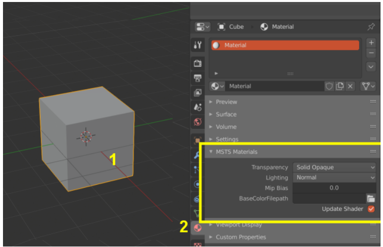

[grid="none",cols="20%,80%",frame="none"]
|===
|Item| Description

|Transparency| Controls the effect of the texture's alpha channel
|Solid Opaque| Alpha channel is ignored, it has no effect.
|Transparency On/Off| Transparent if alpha value below a threshold
|Alpha Blended| Alpha value blends from transparent up to opaque
|Alpha Sorted| Alpha blending with scene depth sort
|Lighting| Selects one of MSTS's special shading modes
|Normal| Sun facing surfaces are lit and opposite facing are shaded
|Specular 25| Strong specular highlight
|Specular 750|  Small specular highlight
|Full Bright| Shaded surfaces appear lit
|Half Bright| Shaded surfaces appear partly lit
|Dark| Sun facing surfaces appear fully shaded
|Cruciform| Indirect ambient lighting only
|Emissive| Surfaces emit light at night
|MipMapLODBias| Controls sharpness of the applied textures. (1) 
|BaseColorFilepath| Select the texture image ( usually a .tga or .bmp file ) to apply to the model.
|Update Shader| Normally when you change a setting on this panel, the Eevee material is changed to match. (2)
|===

_(1) Values range from -8 to +8. Negative values sharpen the image, but can cause excessive moire patterns. Positive values result in texturing blurring, and less moire._

_(2) Disable updates if you are an advanced user wanting to make your own custom Eevee shaders. The Material name isn't used by MSTS or included in the exported .s file._

<<<

=== File Export Panel

[NOTE]
There is no progress bar ( percent complete etc) so the program may appear to hang when exporting large files. Before you begin the export, toggle ON the system console ( under the window menu ) to see progress.  There is a small counter shown at the cursor while the export is in progress.

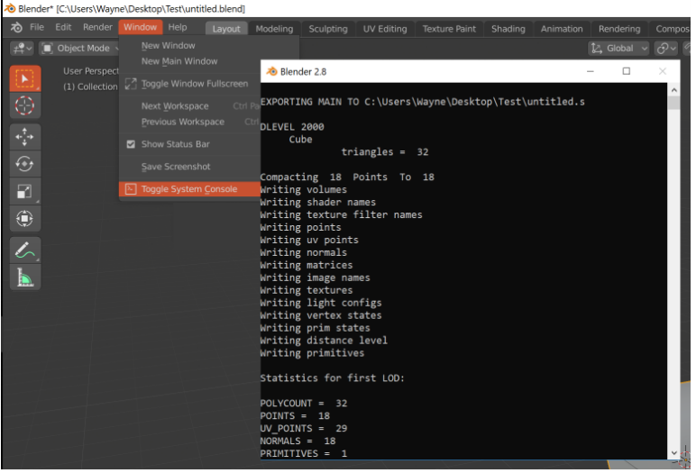

[WARNING]
ENSURE YOU ARE NOT IN EDIT MODE WHEN YOU EXPORT!

To reach the Export Panel, on the top menu bar choose File, Export, OpenRails/MSTS(.s)

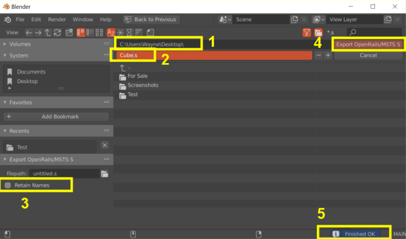

* Enter the directory that contains your shape files, or use the panel to the left to navigate to a folder.
* Enter the filename of the exported shape file.
* RETAIN NAMES - This setting disables most of the optimizations. All object names and hierarchy are retained
in the shape file for users wanting better compatibility with external utilities such as Polymaster.
* USE DDS - This option, when checked, will export the .s file with textures referenced as DDS files instead of ACE
* Initiate the file export.
* Results will appear on the status panel at the bottom of the screen.

== Tutorial - Exporting A Crate

This brief tutorial explains how to organize the parts in the outliner and then how to apply a texture to the cube. The final step is to export it to the MSTS .s shape format.

Open Blender to load the default cube.

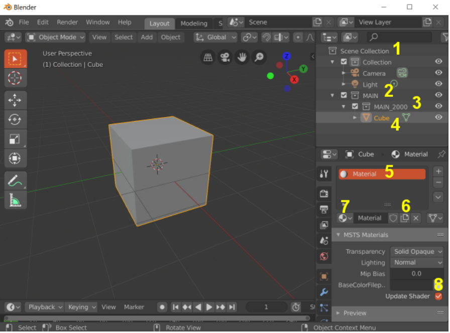

First set up the collection hierarchy.

[grid="none",cols="5%,95%",frame="none"]
|===
|Step| Action

|1 |In the outliner, right click on 'Scene Collection' and create a new collection
|2 |Ctrl click on the new collection and rename it to MAIN. Right click on MAIN and attach a new collection to it
|3 |Ctrl click on this one and rename it to MAIN_2000.  Left click ( and release) to select the default Cube
|4 |Drag it to the `MAIN_2000` collection to assign it to that LOD
|===

Next we will texture the cube to look like a crate.

* We will use the default material (5) that is already applied to the Cube,
* You could have created a new material with (6),
* or you could have selected from an existing material with (7).

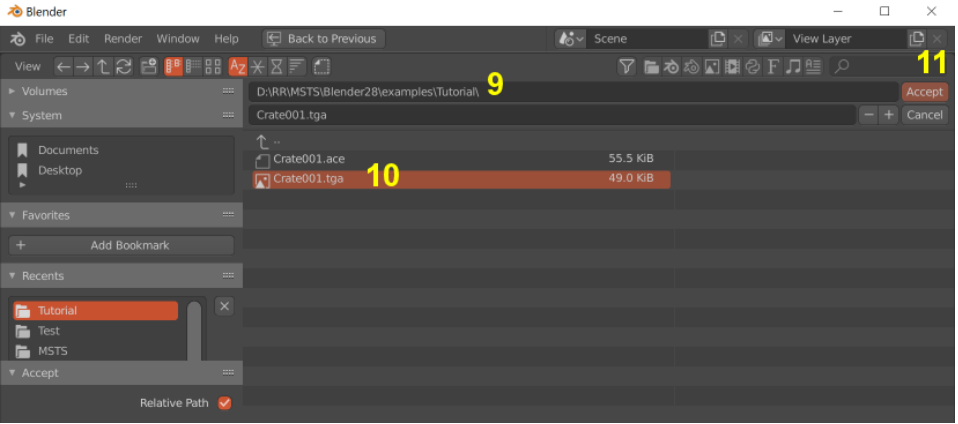

[grid="none",cols="5%,95%",frame="none"]
|===
|Step| Action

|8 |Click the file folder icon in the MSTS Materials panel to assign a texture to the default Material. The `Crate001.tga` texture is provided in the file download package included with this script.
|9 |Enter a path to where you unzipped the Tutorial files or use the shortcuts on the left.
|10 |Choose the `Crate001.tga` texture file.
|11 |Press Accept.
|===

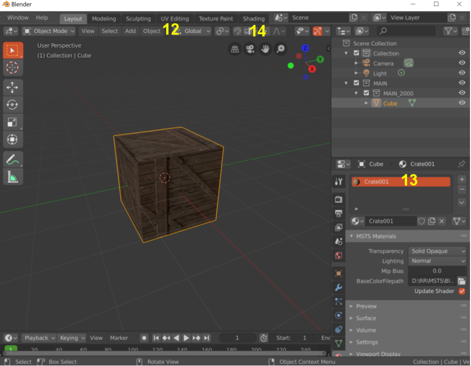

Your cube will be textured. 

* You can use your UV Editing (12) screen to adjust the texture mapping. 
* Notice that the default Material was renamed to Crate001 (13). The MSTS Materials panel will do this so long as there isn't already a material with that name. Also, in the background, the panel has created a full Eevee shader. 
* You can see it on the Shading (14) screen.
* Next, open the Export Panel from the top menu bar choose menu:File[Export, OpenRails/MSTS(.s)]

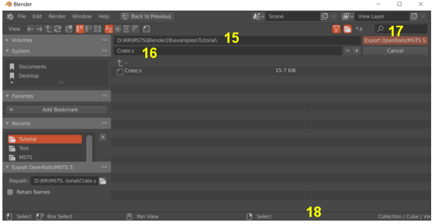

[grid="none",cols="5%,95%",frame="none"]
|===
|Step| Action

|15 |Enter a path to the Tutorial folder or use the shortcuts on the left.
|16 |Export as Crate.S
|17 |Click on Export OpenRails/MSTS.
|18 |Look for 'Finished OK' in the status bar.
|===

[NOTE] 
The exporter creates the .S file only. All other related files must be created manually by other programs. For
example:

* for scenery objects, you must create the .SD file and add an entry to the .REF file.
* for rolling stock you must create the .ENG or .WAG file
* you must convert the texture images to .ACE files and place them in the correct directory.

== Optimizing Model Performance

The console window can help improve your model's performance. Modern graphics cards can draw millions of triangles per second using multiple GPU processors. However, the main limitation arises when setting up for drawing. Each time there is a change in texture image or material settings, the GPU pauses drawing to reconfigure and restart. 

To optimize performance, it's important to minimize the number of Draw calls to the GPU.  Below is an examination of the Blemder log output for the sample engine.  We can review it for useful details.

[source,plaintext]
---- 
EXPORTING MAIN TO D:\git\Blender_MSTS_ORTS_Exporter\MSTSExporter Examples\Loco\MSTS\lps-l1.s

DLEVEL 700
    HeadlightB
            triangles =  174
                            Draw  l1.ace   CLIP   NORMAL  MipBias= 0.0   <2>
    Bell
            triangles =  528  <3>
    HeadlightA
            triangles =  174
    BodyLOD1
            triangles =  5010
                            Draw  chainlink.ace   CLIP   NORMAL  MipBias= 0.0 <4>
                            Draw  l1.ace   ALPHA_SORT   NORMAL  MipBias= 0.0 <5>
                            Draw  diamondplate.ace   OPAQUE   NORMAL  MipBias= 0.0
                            Draw  l1.ace   CLIP   NORMAL  MipBias= 0.0 <6>
                            Draw  l1.ace   CLIP   NORMAL  MipBias= 0.0 <7>
    PANTOGRAPHBOTTOM1B
    Mesh.017
            triangles =  128
                            Draw  l1.ace   CLIP   NORMAL  MipBias= 0.0 <8>
    PANTOGRAPHMIDDLE1B
    Mesh.018
            triangles =  84
                            Draw  l1.ace   CLIP   NORMAL  MipBias= 0.0
    PANTOGRAPHBOTTOM1A
    Mesh.014
            triangles =  128
                            Draw  l1.ace   CLIP   NORMAL  MipBias= 0.0
    PANTOGRAPHMIDDLE1A
    Mesh.015
            triangles =  84
                            Draw  l1.ace   CLIP   NORMAL  MipBias= 0.0
    PANTOGRAPHTOP1A
    Mesh.016
            triangles =  80
                            Draw  l1.ace   CLIP   NORMAL  MipBias= 0.0
    BOGIE2
            triangles =  196
                            Draw  l1.ace   CLIP   NORMAL  MipBias= 0.0
    WHEELS21
            triangles =  248
                            Draw  l1.ace   CLIP   NORMAL  MipBias= 0.0
    WHEELS22
            triangles =  248
                            Draw  l1.ace   CLIP   NORMAL  MipBias= 0.0
    BOGIE1
            triangles =  196
                            Draw  l1.ace   CLIP   NORMAL  MipBias= 0.0
    WHEELS11
            triangles =  248
                            Draw  l1.ace   CLIP   NORMAL  MipBias= 0.0
    WHEELS12
            triangles =  248
                            Draw  l1.ace   CLIP   NORMAL  MipBias= 0.0
DLEVEL 2000
    BodyLOD2
            triangles =  48 <9>
                            Draw  l1.ace   OPAQUE   NORMAL  MipBias= 0.0

Compacting  9574  Points  To  5265
Writing volumes
Writing shader names
Writing texture filter names
Writing points
Writing uv points
Writing normals
Writing matrices
Writing image names
Writing textures
Writing light configs
Writing vertex states
Writing prim states
Writing distance level
Writing primitives
Writing primitives
Writing primitives
Writing primitives
Writing primitives
Writing primitives
Writing primitives
Writing primitives
Writing primitives
Writing primitives
Writing primitives
Writing primitives
Writing primitives
Writing distance level
Writing primitives

LOD:  700
    Triangles  =  7774 <1>
    Draw Calls =  17
LOD:  2000
    Triangles  =  48
    Draw Calls =  1
IMAGES:
    l1.ace
    diamondplate.ace
    chainlink.ace

FINISHED OK

----

<1> At the end of the report, it tells you how many triangles are drawn for each LOD level and more importantly how many Draws were issued to the GPU. To understand what triggers these Draws you can look to the top section of the report

<2> The Headlight object triggers the first Draw  using the `L1.ace` texture with the material settings shown

<3> The Bell does not trigger a Draw because it uses the same texture and material as HeadlightB and so it was added to that Draw. Same for HeadlightA. We basically get these parts for free so it should be our objective to use the same texture and material on as many parts as possible

<4> The BodyLOD1 object has some faces textured with 'chainlink.ace'. So this triggered a new Draw for that; same for 'diamondplate.ace'. BodyLOD1 also uses 'L1.ace' So far all of those faces are being added to the previous Draw  for the headlight

<5> Shows a new Draw set up for 'l1.ace'. This is because these faces have a material transparency set to ALPHA instead of CLIP. That triggers a new Draw for that setup. These are for the windows on the loco, so we will need to keep that extra draw

<6> The next Draw uses the same texture and material as the one for Headlight. So you can assume it was triggered because the first Draw for Headlight was filled up. MSTS has a maximum number of triangles that it allows in a Draw ( MSTS calls it a primitive )

<7> So when we reach that limit, the exporter starts a new Draw.  There is not much we can do to reduce these Draws except to trim out excess mesh triangles

<8> Is for PANTOGRAPHBOTTOM1B. It uses the same texture and material settings as the previous one (7)  but it can’t be added to that Draw because this part is animated. Any animated node triggers a new Draw. That includes both ones animated in Blender, like PANTOGRAPHBOTTOM1B, as well as the automatically animated ones like BOGIEx and WHEELSxx. So its quite important to organize your animated parts to use only one texture and material settings per node , otherwise you could trigger multiple Draws for each animated part

<9> The second LOD level is shown at here. It has just a single Draw. There are big performance benefits to organizing your distant LODs to use a single draw

<<<

=== Upgrading Models From Blender 2.79

Version 2.8 was a 'breaking' change to Blender overall. In additional to fundamentally changing the user interface, this version did not just create an issue with MSTS files but also affects all files made in
previous versions of Blender. Blender has introduced the new Eevee render engine and associated material system and discontinued the legacy 'Blender Internal' and 'Face Texture' system.

This means when you load an older version blend file that uses legacy materials, it will come into Blender 2.8
untextured and with empty material slots. However the UV mapping is retained at least which helps. For MSTS
models you can use the new MSTS Materials panel to easily create the needed materials and shaders. If you have
multiple textures on one mesh, you will use the 'Assign' tool to apply the new materials to the correct part of the
mesh.

The other change relates to the method of assigning parts to LODs. The previous method, using custom Object
Properties like `DLEVEL`, `DMIN`, `DMAX` etc has always been awkward to use. This seems like a good time to
replace it with something better. 

In the "Arranging Parts" section of this document there is an explaination of how the custom properties will be replaced
with Blender 2.8's new 'collections' feature.

=== Migration Steps

In Blender 2.79 set Distance Level Selection to OFF and re-save file, this ensures all parts are in the visible state.

* In Blender 2.8, File Open with Load UI disabled
* Comes in without any texturing.
* Create `MAIN` collection
* Look at `MAIN` properties to determine DLEVEL's needed for LOD Collections
* Create LOD Collections in `MAIN`
* Remove `DLEVELS` properties from `MAIN`
* Use `DMAX` and `DMIN` properties on each object to assign it to the correct LOD Collection
* Remove `DMAX` and `DMIN` Properties from all objects.
* Create and apply materials.
* UV Mapping should be OK
* Set Current Frame to 0 in Animation panel

=== Advantages of Blender 2.8+

Some of the advantages of collections over our previous method are:

* easy to assign LODs by dragging parts around or using the btn:[M] key to assign collections
* easy to change distance level settings by editing LOD collection name, eg rename `MAIN_0700` to `MAIN_0500`
* good visibility of settings -all your LOD assignments show in the outline panel
* and the LOD assignments are also clearly shown in the object's 'Collection' panel
* you don't need the MSTS 'dlevel' control panel, choose LODs using the check boxes in the outliner
* future support for multiple LOD controllers, ie main has lods at 700 and 2000, but wheels have 100, 200 and 500.
* a part can be assigned to more than one LOD
* render in Cycles or Eevee, you can select which LOD appears in your render
* it uses standard Blender features - there's no hidden properties

=== TODO Items 

[NOTE]
To Maintainer: FINISH THIS SECTION WHEN BLENDER PROVIDES UPDATE PATH FOR 2.79 FILES. So far, nothing.

==== TODO for Future Updates

* add a progress bar ( when available in the Blender API )
* document or remove hidden Normals override options ( superceded by Blender's new Normals Modifier )

==== IDEAS for Future Updates

*  add support for curves, particle systems, dupliverts
* support undocumented MSTS capability, eg
a. Wrap, Clamp, Extend etc
b. double sided faces
c. bump mapping and environmental reflections
d. AddATex, SubractATex, etc and other undocumented shaders
e. zBias
f. use of lod_control objects to improve LOD efficiency
* option to export texture files
* option to compress shape file
* options to generate .SD, .ENG, .WAG or .REF